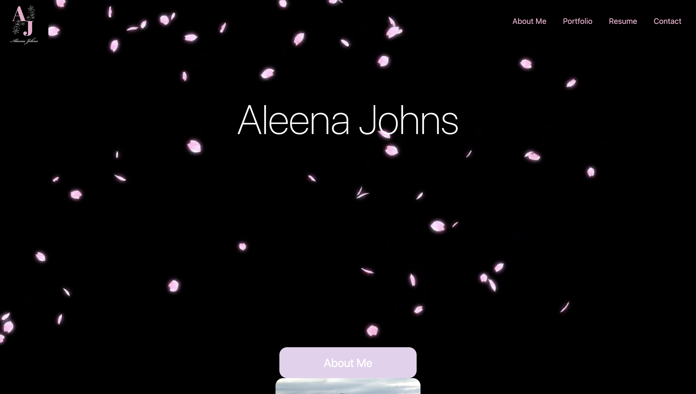

# AAJ.Portfolio

This portfolio was created to showcase my skills as a web developer. You will see the following
sections: About me, Portfolio, Resume, and Contact. 

## Authors

- [@aleenaalexia](https://github.com/aleenaalexia)

## Link to Website: 
https://aleenaalexia.github.io/AAJ.Portfolio/

# Hi, I'm Aleena! 👋
Github: https://github.com/aleenaalexia

## 🔗 Links

## License

[MIT](https://choosealicense.com/licenses/mit/)

## Screenshots

